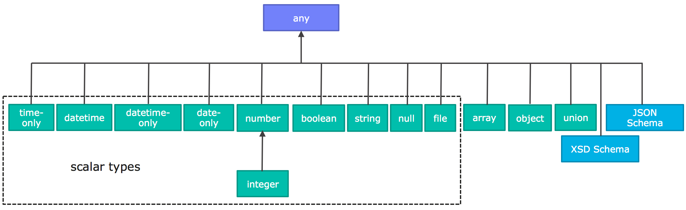

= 用RAML来设计RESTful风格的API

RAML全称是RESTful API Modeling Language（RESTful API建模语言），由MuleSoft公司成员主导设计。

RAML的本质上是一组API设计规范，截止到2017年3月13日，最新版本是1.0。它基于YAML 1.2语法规范，从它的名字上可以看出，RAML主要是在API的设计阶段使用，它能够对RESTful API进行建模，然后导出文档、HTML模板以及多种编程语言的SDK，对于前后端分离的架构很有帮助。

== 文档头

RAML文档头部分描述了关于API的基本信息，还有类型和特征等辅助信息。

RAML API文档中的节点可以以任意顺序出现。而RAML的处理器在解析时必须保存节点顺序，如果包含数组，那么还要保存数组中元素的顺序。

下面GitHub v3公开API的一个RAML API定义的示例：

[source,java]
----
#%RAML 1.0
title: GitHub API
version: v3
baseUri: https://api.github.com
mediaType:  application/json
securitySchemes:
  oauth_2_0: !include securitySchemes/oauth_2_0.raml
types:
  Gist:  !include types/gist.raml
  Gists: !include types/gists.raml
resourceTypes:
  collection: !include types/collection.raml
traits:
securedBy: [ oauth_2_0 ]
/search:
  /code:
    type: collection
    get:
----

下表列出了RAML文档头中可以出现的节点：

|====
| 节点名 | 说明
| title | 用于描述API的简短标题
| description? | 字符串类型的API的具体描述，可以使用 https://github.com/raml-org/raml-spec/blob/master/versions/raml-10/raml-10.md/#markdown[markdown] 格式。
| version? | 说明API的版本，如"v1"，字符串类型。
| baseUri? | 提供资源和服务的 https://github.com/raml-org/raml-spec/blob/master/versions/raml-10/raml-10.md/#base-uri-and-base-uri-parameters[根URIs]。可以是 https://github.com/raml-org/raml-spec/blob/master/versions/raml-10/raml-10.md/#template-uri[模板URI].
| baseUriParameters? |  https://github.com/raml-org/raml-spec/blob/master/versions/raml-10/raml-10.md/#base-uri-and-base-uri-parameters[根Uri]（模板）使用的参数名 。
| protocols? | 此API支持的 https://github.com/raml-org/raml-spec/blob/master/versions/raml-10/raml-10.md/#protocols[协议]。
| mediaType? | 请求和响应报问题的 https://github.com/raml-org/raml-spec/blob/master/versions/raml-10/raml-10.md/#default-media-types[默认媒体类型]，如"application/json"。
| documentation? | API的附加 https://github.com/raml-org/raml-spec/blob/master/versions/raml-10/raml-10.md/#user-documentation[文档]。
| schemas? | 在RAML 0.8中等价于"types"的别名，但新版本中不再推荐使用，因为"types"节点支持XML和JSON的schemas。
| types? | https://github.com/raml-org/raml-spec/blob/master/versions/raml-10/raml-10.md/#defining-types[(数据)类型]声明。
| traits? | https://github.com/raml-org/raml-spec/blob/master/versions/raml-10/raml-10.md/#resource-types-and-traits[traits]的声明。
| resourceTypes? | API使用的 https://github.com/raml-org/raml-spec/blob/master/versions/raml-10/raml-10.md/#resource-types-and-traits[资源类型] 。
| annotationTypes? | 注解使用的 https://github.com/raml-org/raml-spec/blob/master/versions/raml-10/raml-10.md/#declaring-annotation-types[注解类型]声明。
| (<annotationName>)? | API使用的 https://github.com/raml-org/raml-spec/blob/master/versions/raml-10/raml-10.md/#annotations[注解]。注解是用圆括号包裹的键值映射，括号中是注解的名字，而值是注解的实例。
| securitySchemes? | 对每个资源和方法使用的 https://github.com/raml-org/raml-spec/blob/master/versions/raml-10/raml-10.md/#security-schemes[安全schemes]。
| securedBy? | https://github.com/raml-org/raml-spec/blob/master/versions/raml-10/raml-10.md/#applying-security-schemes[安全schemes]。
| uses? | 导入扩展 https://github.com/raml-org/raml-spec/blob/master/versions/raml-10/raml-10.md/#libraries[库] .
| /<relativeUri>? | 以反斜杠开始的URIs相对路径，指代API资源。 https://github.com/raml-org/raml-spec/blob/master/versions/raml-10/raml-10.md/#resources-and-nested-resources[资源节点]总是以反斜杠开始的，它可以是根节点，也可以是子节点，例如 /users 和 /{groupId}。
|====

"schemas" 和 "types" 节点是互斥的同义词：处理器不允许在根级别同时处理两个以上的节点。我们建议用"types"节点替代"schemas"节点，因为我们将在未来的RAML版本中移除"schemas"别名。

=== https://github.com/raml-org/raml-spec/blob/master/versions/raml-10/raml-10.md/#user-documentation[用户文档]

可选的**documentation**节点包含了各种文档，这些文档主要用做API的用户手册和和参考文档。例如文档可以清晰的描述API如何工作，并说明技术和业务的场景。

documentation节点的值是一个或多个documents，每个document都必须是包含了下面两个键值对的映射：

|====
| 键值 | 描述
| title | 文档标题，必须是非空字符串。
| content | 文档内容。它必须是非空字符串，同时可以使用  https://github.com/raml-org/raml-spec/blob/master/versions/raml-10/raml-10.md/#markdown[markdown]格式。
|====

示例如下：

[source,java]
----
#%RAML 1.0
title: ZEncoder API
baseUri: https://app.zencoder.com/api
documentation:
 - title: Home
   content: |
     Welcome to the _Zencoder API_ Documentation. The _Zencoder API_
     allows you to connect your application to our encoding service
     and encode videos without going through the web interface. You
     may also benefit from one of our
     [integration libraries](https://app.zencoder.com/docs/faq/basics/libraries)
     for different languages.
 - title: Legal
   content: !include docs/legal.markdown
----

=== https://github.com/raml-org/raml-spec/blob/master/versions/raml-10/raml-10.md/#base-uri-and-base-uri-parameters[Base URI 与 Base URI参数]

可选的 **baseUri** 节点指定API的根URI，其值必须是一个字符串，同时还要符合 https://www.ietf.org/rfc/rfc2396.txt[RFC2396] 或者 https://github.com/raml-org/raml-spec/blob/master/versions/raml-10/raml-10.md/#template-uri[URI模板]规范。

如果 baseUri 值是一个 https://github.com/raml-org/raml-spec/blob/master/versions/raml-10/raml-10.md/#template-uri[URI模板]，那么可以使用base URI参数：

|====
| URI Parameter | 值
| version | 根级别版本的值
|====

任何出现在baseUri中的URI模板参数都可以通过 **baseUriParameters**  节点在API定义根路径下进行描述。baseUriParameters节点具有和 https://github.com/raml-org/raml-spec/blob/master/versions/raml-10/raml-10.md/#template-uris-and-uri-parameters[uriParameters]一样的结构和语义，除此之外它还指定了URI中的参数。

下面的 RAML API 定义使用了 https://github.com/raml-org/raml-spec/blob/master/versions/raml-10/raml-10.md/#template-uri[URI模板]作为根URI：

[source,java]
----
#%RAML 1.0
title: Salesforce Chatter REST API
version: v28.0
baseUri: https://na1.salesforce.com/services/data/{version}/chatter
----

下面的例子明确指定了一个 base URI 参数：

[source,java]
----
#%RAML 1.0
title: Amazon S3 REST API
version: 1
baseUri: https://{bucketName}.s3.amazonaws.com
baseUriParameters:
  bucketName:
    description: The name of the bucket
----

在baseAPI以一个或多个反斜杠（``/``)结束时，这些末尾的斜线会被忽略。例如下面两个资源的的相对路径是 ``http://api.test.com/common/users`` 和 ``http://api.test.com/common/users/groups``。

[source,java]
----
baseUri: http://api.test.com/common/
/users:
  /groups:
----

下面的例子更复杂，它们的实际资源路径如下：``//api.test.com//common/``, ``//api.test.com//common//users/``, and ``//api.test.com//common//users//groups//``.

[source,java]
----
baseUri: //api.test.com//common//
/:
  /users/:
    /groups//:
----

=== https://github.com/raml-org/raml-spec/blob/master/versions/raml-10/raml-10.md/#protocols[协议]

可选的 **protocols** 节点说明了API支持的协议。如果 protocaols 没有明确指定，那么一或多个protocols会被包含在baseUri节点中。protocals节点必须是非空的字符串数组，可以是HTTP和/或HTTPS，不区分大小写。

参见下方的示例：

[source,java]
----
#%RAML 1.0
title: Salesforce Chatter REST API
version: v28.0
protocols: [ HTTP, HTTPS ]
baseUri: https://na1.salesforce.com/services/data/{version}/chatter
----

=== https://github.com/raml-org/raml-spec/blob/master/versions/raml-10/raml-10.md/#default-media-types[默认请求类型]

**mediaType**这个节点是可选的，它能设置默认的请求或响应类型，

mediaType节点必须是一个字符串序列，它用于说明该URL的内容类型。你可以在 https://tools.ietf.org/html/rfc6838[RFC6838]这个网址去看看支持的媒体类型有哪些。

下面给出了一个json类型的内容的RAML文档示例，这向用户说明：如果请求中没有明确指定媒体类型，那么此API只会接受和响应JSON格式的内容。

[source,java]
----
#%RAML 1.0
title: New API
mediaType: application/json
----

下面这个示例展示了一个可以同时接收和返回Json或xml的RAML片段。

[source,java]
----
#%RAML 1.0
title: New API
mediaType: [ application/json, application/xml ]
----

你可以明确指定哪些类型的内容（Json或xml）可用于哪种请求（POST或GET操作）。下面的片段说明了 ``/list`` 会返回一个JSON或XML的资源，而``/send``只会默认返回JSON类型的资源。详情参见
 https://github.com/raml-org/raml-spec/blob/master/versions/raml-10/raml-10.md/#bodies[body]。

[source,java]
----
#%RAML 1.0
title: New API
mediaType: [ application/json, application/xml ]
types:
  Person:
  Another:
/list:
  get:
    responses:
      200:
        body: Person[]
/send:
  post:
    body:
      application/json:
        type: Another
----

=== https://github.com/raml-org/raml-spec/blob/master/versions/raml-10/raml-10.md/#default-security[默认的安全设置]

**securedBy**节点是可选的，它可以用来设置默认的安全schemes，从而为API的每一个资源的每一个方法添加保护。该节点的值可以是多个security scheme的name。详情参见 https://github.com/raml-org/raml-spec/blob/master/versions/raml-10/raml-10.md/#applying-security-schemes[Applying Security Schemes]，里面说明了应用程序如何通过继承机制解析多个security schemes。

下面的示例展示了一个API，它允许通过OAuth 2.0或者OAuth 1.1协议进行访问：

[source,java]
----
#%RAML 1.0
title: Dropbox API
version: 1
baseUri: https://api.dropbox.com/{version}
securedBy: [ oauth_2_0, oauth_1_0 ]
securitySchemes:
  oauth_2_0: !include securitySchemes/oauth_2_0.raml
  oauth_1_0: !include securitySchemes/oauth_1_0.raml
----

== RAML 数据类型

=== https://github.com/raml-org/raml-spec/blob/master/versions/raml-10/raml-10.md/#introduction-1[简介]

RAML 1.0提出了**数据类型**的概念，它提供了一种便捷而有力的描述API数据的方式。数据类型可以对数据的类型进行声明，从而为其添加可校验的特性。

数据类型可以描述URI的资源、查询参数、请求或响应头，甚至是请求或响应报文体。数据类型可以是预建的或是自定义的。预建的类型可以用于描述出现在API的任何地方的数据。自定义类型可以通过继承的方式，由预建的类型进行衍生，然后像预建的类型那样使用。继承的类型无法创建任何循环依赖，但可以被内联继承。

下面展示了一个RAML示例，它定义了一个User类型，并且声明了firstname, lastname, 以及 age 三个属性，这三个属性分别使用了预建的string和number类型。最后，我们在payload中使用了这个User类型（schema）。

[source,java]
----
#%RAML 1.0
title: API with Types
types:
  User:
    type: object
    properties:
      firstname: string
      lastname:  string
      age:       number
/users/{id}:
  get:
    responses:
      200:
        body:
          application/json:
            type: User
----

RAML类型声明类似于JSON schema定义。事实上，RAML类型可以用于替代JSON和XML schemas，或者用于作为补充。RAML类型的语法被设计得更易于使用，并且比JSON和XML的schemas更简洁，甚至比它们更灵活且更具有表现力。下面的片段展示了多个类型声明的示例：

[source,java]
----
#%RAML 1.0
title: My API with Types
mediaType: application/json
types:
  Org:
    type: object
    properties:
      onCall: AlertableAdmin
      Head: Manager
  Person:
    type: object
    properties:
      firstname: string
      lastname:  string
      title?:    string
  Phone:
    type: string
    pattern: "[0-9|-]+"
  Manager:
    type: Person
    properties:
      reports: Person[]
      phone:  Phone
  Admin:
    type: Person
    properties:
      clearanceLevel:
        enum: [ low, high ]
  AlertableAdmin:
    type: Admin
    properties:
      phone: Phone
  Alertable: Manager | AlertableAdmin
/orgs/{orgId}:
  get:
    responses:
      200:
        body:
          application/json:
            type: Org
----

=== 概览

这一节是一个概览。

RAML类型系统的灵感来源于Java，同时又和XSD和Json Schemas类似。

RAML类型概览：

*   Types和Java类很相似。
    **   Types借鉴了JSON Schema，XSD，以及其他面向对象语言的类型的特性。
*   你可以通过继承其他类型来定义一个新的类型。
    **   和Java不同，RAML类型可以进行多继承。
*   Types可以划分为四种：外部（扩展）类型、对象类型、数组类型、scalar（标量）类型。
*   Types可以定义两种成员：**properties（属性）**和**facets（面）**。二者都可以被继承。
    **   **Properties（属性）**非常常见，对象由属性组成。
    **   **Facets（面）**是比较特别配置，你可以通过facet值的特征来描述类型。例如minLength（最小长度）和maxLength(最大长度）。
*   只有对象类型可以声明属性，但所有的类型都可以声明facets（面）。
*   你可以通过实现facets，给facets一个具体的值，从而指定scalar类型。
*   为了指定一个对象类型，你需要定义属性。

=== https://github.com/raml-org/raml-spec/blob/master/versions/raml-10/raml-10.md/#defining-types[定义类型]

类型可以通过继承API预定义类型来声明一个新的类型，在API的根节点下，**types**节点是可选的，你也可以直接包含另一个RAML库。你应该使用 https://github.com/raml-org/raml-spec/blob/master/versions/raml-10/raml-10.md/#type-declarations[键值对（map）]的方式来声明一个类型，就像下面这样：

[source,java]
----
types:
  Person: # key name
    # value is a type declaration
----

=== https://github.com/raml-org/raml-spec/blob/master/versions/raml-10/raml-10.md/#type-declarations[类型声明]

类型声明可以通过添加功能性facets（例如属性）或非功能性的facets（例如描述），来引用、封装或者继承其他类型，同样，也可以使用指代其他类型的**类型表达式**。下面的表格展示了所有类型声明可以使用的facet：

|====
| Facet | 描述
| default? | 类型的默认值。API请求如果没有找到实例的类型，例如一个查询参数没有被指定类型时，API必须将其指定为default中描述的一种默认类型。类似的，API响应如果没有指定实例类型，那么客户端必须将服务器响应的实例指定为default中描述的特定类型。URI参数则比较特殊，如果某个指定了默认facet的URI参数没有获取到，那么客户端必须用一个默认值来代替它。
| schema? | 等价于"type"的别名，RAML 0.8中已经不再建议使用。后续的RAML API版本中会将此Facet移除，并用"type"来替代它。"type"同时支持XML和Json。
| type? | 当前类型继承或封装的一个类型。它的值只能是：a) 用户自定义类型名； b) RAML预建类型名(object对象, array数组, 或者scalar类型； c) 一个内联（匿名）类型的声明。
| example? | 一个关于此类型如何使用的示例。可以通过文档生成器来生成一个此类的对象的值，在"examples"facet被定义的时候，此facet不可用。详情参见 https://github.com/raml-org/raml-spec/blob/master/versions/raml-10/raml-10.md/#defining-examples-in-raml[Examples]。
| examples? | 此类型的示例（多个）。详情参见 https://github.com/raml-org/raml-spec/blob/master/versions/raml-10/raml-10.md/#defining-examples-in-raml[Examples]。
| displayName? | 可选的facet，用于向阅读者展示一个友好的名称。
| description? | 类型的详细描述。它的值可以是字符串，也可以是 https://github.com/raml-org/raml-spec/blob/master/versions/raml-10/raml-10.md/#markdown[markdown]格式。
| (<annotationName>)? | 此API所使用的https://github.com/raml-org/raml-spec/blob/master/versions/raml-10/raml-10.md/#annotations[注解]。每个注解都是用括号包围起来的键值对。
| facets? | 附加的一个Map，它会为每一个继承此类型的子类型添加此facets限制。详情参见 https://github.com/raml-org/raml-spec/blob/master/versions/raml-10/raml-10.md/#user-defined-facets[用户自定义Facets] 。
| xml? | 为此类型添加 https://github.com/raml-org/raml-spec/blob/master/versions/raml-10/raml-10.md/#xml-serialization-of-type-instances[类型实例的XML序列化]功能。
| enum? | 此类型可用的枚举值，可以是数组。当配置此facet之后，此类型的值只能是此facet列表的值中的其中之一。
|====

"schema"和"type"这两个facets只能择一而使用，下面是两个错误的示例：

[source,java]
----
types:
  Person:
    schema: # invalid as mutually exclusive with `type`
    type: # invalid as mutually exclusive with `schema`
----

[source,java]
----
/resource:
  get:
    responses:
      200:
        body:
          application/json: # start type declaration
            schema: # invalid as mutually exclusive with `type`
            type: # invalid as mutually exclusive with `schema`
----

官方建议用"type"来代替"schema"，因为schema在后续RAML版本中不再建议使用，而且"type"标签同时支持XML和JSON schema。

=== 预建类型

RAML类型系统定义了下列预建类型：

*   https://github.com/raml-org/raml-spec/blob/master/versions/raml-10/raml-10.md/#the-any-type[any任意]
*   https://github.com/raml-org/raml-spec/blob/master/versions/raml-10/raml-10.md/#object-type[object对象]
*   https://github.com/raml-org/raml-spec/blob/master/versions/raml-10/raml-10.md/#array-type[array数组]
*   https://github.com/raml-org/raml-spec/blob/master/versions/raml-10/raml-10.md/#union-type[union组合]类型表达式
*   https://github.com/raml-org/raml-spec/blob/master/versions/raml-10/raml-10.md/#scalar-types[scalar类型]：number数字, boolean布尔, string字符串, date-only单日期, time-only单时间, datetime-only单日期时间, datetime日期时间, file文件, integer整型, 或者nil空。

作为附加的预建类型，RAML类型系统也允许定义  https://github.com/raml-org/raml-spec/blob/master/versions/raml-10/raml-10.md/#using-xml-and-json-schema[JSON或XML schema]。

下图展示了一个继承树，所有的类型都是由顶级类型 ``any`` 派生出来的：

==== "Any" 类型

任何类型的都是由 ``any``类型派生出来的，所有类型都默认继承它（无论你是否显式继承）。上图中的基本类型都派生自``any``，``any``是所有类型的顶级父类。在RAML中，``any``的角色类似于Java语言中的Object所扮演的角色，所有Java类型都直接或间接的继承自Object类。

``any``类型没有facets。

==== https://github.com/raml-org/raml-spec/blob/master/versions/raml-10/raml-10.md/#object-type[Object对象类型]

所有包含在继承树中的预建对象基类都可以在声明中使用下列facets：

|====
| Facet | 描述
| properties? | 此类的实例可以或必须拥有的 https://github.com/raml-org/raml-spec/blob/master/versions/raml-10/raml-10.md/#property-declarations[属性]。
| minProperties? | 此类的实例所允许的此属性的最小数值。
| maxProperties? | 此类的实例所允许的此属性的最大数值。
| additionalProperties? | 此对象实例是否包含 https://github.com/raml-org/raml-spec/blob/master/versions/raml-10/raml-10.md/#additional-properties[附加的属性]。  

**默认值：** ``true``
| discriminator? | Determines the concrete type of an individual object at runtime when, for example, payloads contain ambiguous types due to unions or inheritance. The value must match the name of one of the declared ``properties`` of a type. Unsupported practices are inline type declarations and https://github.com/raml-org/raml-spec/blob/master/versions/raml-10/raml-10.md/#using-discriminator[using ``discriminator``] with non-scalar properties.
| discriminatorValue? | Identifies the declaring type. Requires including a ``discriminator`` facet in the type declaration. A valid value is an actual value that might identify the type of an individual object and is unique in the hierarchy of the type. Inline type declarations are not supported.  

**Default:** The name of the type
|====

An object type is created by explicit inheritance from the built-in type object:

[source,java]
----
#%RAML 1.0
title: My API With Types
types:
  Person:
    type: object
    properties:
      name:
        required: true
        type: string
----

===== https://github.com/raml-org/raml-spec/blob/master/versions/raml-10/raml-10.md/#property-declarations[<svg aria-hidden="true" class="octicon octicon-link" height="16" version="1.1" viewBox="0 0 16 16" width="16"><path fill-rule="evenodd" d="M4 9h1v1H4c-1.5 0-3-1.69-3-3.5S2.55 3 4 3h4c1.45 0 3 1.69 3 3.5 0 1.41-.91 2.72-2 3.25V8.59c.58-.45 1-1.27 1-2.09C10 5.22 8.98 4 8 4H4c-.98 0-2 1.22-2 2.5S3 9 4 9zm9-3h-1v1h1c1 0 2 1.22 2 2.5S13.98 12 13 12H9c-.98 0-2-1.22-2-2.5 0-.83.42-1.64 1-2.09V6.25c-1.09.53-2 1.84-2 3.25C6 11.31 7.55 13 9 13h4c1.45 0 3-1.69 3-3.5S14.5 6 13 6z"></path></svg>]Property Declarations

Properties of object types are defined using the OPTIONAL **properties** facet. The RAML Specification calls the value of the "properties" facet a "properties declaration". The properties declaration is a map of keys and values. The keys are valid property names for declaring a type instance. The values are either a name of a type or an inline type declaration.

The properties declaration can specify whether a property is required or optional.

|====
| Facet | Description
| required? | Specifies that the property is required or not.  

**Default:** ``true``.
|====

The following example declares an object type having two properties:

[source,java]
----
types:
  Person:
    properties:
      name:
        required: true
        type: string
      age:
        required: false
        type: number
----

The following example shows a common idiom:

[source,java]
----
types:
  Person:
    properties:
      name: string # equivalent to ->
                   # name:
                   #  type: string
      age?: number # optional property; equivalent to ->
                   # age:
                   #  type: number
                   #  required: false
----

When the ``required`` facet on a property is specified explicitly in a type declaration, any question mark in its property name is treated as part of the property name rather than as an indicator that the property is optional.

For example, in

[source,java]
----
types:
  profile:
    properties:
      preference?:
        required: true
----

The ``profile`` type has a property named ``preference?`` that includes the trailing question mark. The following snippets show two ways of making ``preference?`` optional:

[source,java]
----
types:
  profile:
    properties:
      preference?:
        required: false
----

or

[source,java]
----
types:
  profile:
    properties:
      preference??:
----

Note:

When an object type does not contain the "properties" facet, the object is assumed to be unconstrained and therefore capable of containing any properties of any type.

===== https://github.com/raml-org/raml-spec/blob/master/versions/raml-10/raml-10.md/#additional-properties[<svg aria-hidden="true" class="octicon octicon-link" height="16" version="1.1" viewBox="0 0 16 16" width="16"><path fill-rule="evenodd" d="M4 9h1v1H4c-1.5 0-3-1.69-3-3.5S2.55 3 4 3h4c1.45 0 3 1.69 3 3.5 0 1.41-.91 2.72-2 3.25V8.59c.58-.45 1-1.27 1-2.09C10 5.22 8.98 4 8 4H4c-.98 0-2 1.22-2 2.5S3 9 4 9zm9-3h-1v1h1c1 0 2 1.22 2 2.5S13.98 12 13 12H9c-.98 0-2-1.22-2-2.5 0-.83.42-1.64 1-2.09V6.25c-1.09.53-2 1.84-2 3.25C6 11.31 7.55 13 9 13h4c1.45 0 3-1.69 3-3.5S14.5 6 13 6z"></path></svg>]Additional Properties

By default, any instance of an object can have additional properties beyond those specified in its data type ``properties`` facet. Assume the following code is an instance of the data type ``Person`` that is described in the previous section.

[source,java]
----
Person:
  name: "John"
  age: 35
  note: "US" # valid additional property `note`
----

The property ``note`` is not explicitly declared in the ``Person`` data type, but is valid because all additional properties are valid by default.

To restrict the addition of properties, you can set the value of the ``additionalProperties`` facet to ``false``, or you can specify regular expression patterns that match sets of keys and restrict their values. The latter are called "pattern properties". The patterns are delineated by pairs of opening and closing ``/`` characters, as follows:

[source,java]
----
#%RAML 1.0
title: My API With Types
types:
  Person:
    properties:
      name:
        required: true
        type: string
      age:
        required: false
        type: number
      /^note\d+$/: # restrict any properties whose keys start with "note"
                   # followed by a string of one or more digits
        type: string
----

This pattern property restricts any additional properties whose keys start with "note" followed by a string of one or more digits. Consequently, the example of an object instance that declares an additional ``note`` property with the value "US" is valid, but the same property is invalid with a non-string value:

[source,java]
----
Person:
  name: "John"
  age: 35
  note: 123 # not valid as it is not a string
  address: "US" # valid as it does not match the pattern
----

To force all additional properties to be strings, regardless of their keys, use:

[source,java]
----
#%RAML 1.0
title: My API With Types
types:
  Person:
    properties:
      name:
        required: true
        type: string
      age:
        required: false
        type: number
      //: # force all additional properties to be a string
        type: string
----

If a pattern property regular expression also matches an explicitly declared property, the explicitly declared property definition prevails. If two or more pattern property regular expressions match a property name in an instance of the data type, the first one prevails.

Moreover, if ``additionalProperties`` is ``false`` (explicitly or by inheritance) in a given type definition, then explicitly setting pattern properties in that definition is not allowed. If ``additionalProperties`` is ``true`` (or omitted) in a given type definition, then pattern properties are allowed and further restrict the additional properties allowed in that type.

===== https://github.com/raml-org/raml-spec/blob/master/versions/raml-10/raml-10.md/#object-type-specialization[<svg aria-hidden="true" class="octicon octicon-link" height="16" version="1.1" viewBox="0 0 16 16" width="16"><path fill-rule="evenodd" d="M4 9h1v1H4c-1.5 0-3-1.69-3-3.5S2.55 3 4 3h4c1.45 0 3 1.69 3 3.5 0 1.41-.91 2.72-2 3.25V8.59c.58-.45 1-1.27 1-2.09C10 5.22 8.98 4 8 4H4c-.98 0-2 1.22-2 2.5S3 9 4 9zm9-3h-1v1h1c1 0 2 1.22 2 2.5S13.98 12 13 12H9c-.98 0-2-1.22-2-2.5 0-.83.42-1.64 1-2.09V6.25c-1.09.53-2 1.84-2 3.25C6 11.31 7.55 13 9 13h4c1.45 0 3-1.69 3-3.5S14.5 6 13 6z"></path></svg>]Object Type Specialization

You can declare object types that inherit from other object types. A sub-type inherits all the properties of its parent type. In the following example, the type ``Employee`` inherits all properties of its parent type ``Person``.

[source,java]
----
#%RAML 1.0
title: My API With Types
types:
  Person:
    type: object
    properties:
      name:
        type: string
  Employee:
    type: Person
    properties:
      id:
        type: string
----

A sub-type can override properties of its parent type with the following restrictions: 1) a required property in the parent type cannot be changed to optional in the sub-type, and 2) the type declaration of a defined property in the parent type can only be changed to a narrower type (a specialization of the parent type) in the sub-type.

===== https://github.com/raml-org/raml-spec/blob/master/versions/raml-10/raml-10.md/#using-discriminator[<svg aria-hidden="true" class="octicon octicon-link" height="16" version="1.1" viewBox="0 0 16 16" width="16"><path fill-rule="evenodd" d="M4 9h1v1H4c-1.5 0-3-1.69-3-3.5S2.55 3 4 3h4c1.45 0 3 1.69 3 3.5 0 1.41-.91 2.72-2 3.25V8.59c.58-.45 1-1.27 1-2.09C10 5.22 8.98 4 8 4H4c-.98 0-2 1.22-2 2.5S3 9 4 9zm9-3h-1v1h1c1 0 2 1.22 2 2.5S13.98 12 13 12H9c-.98 0-2-1.22-2-2.5 0-.83.42-1.64 1-2.09V6.25c-1.09.53-2 1.84-2 3.25C6 11.31 7.55 13 9 13h4c1.45 0 3-1.69 3-3.5S14.5 6 13 6z"></path></svg>]Using Discriminator

When payloads contain ambiguous types due to unions or inheritance, it is often impossible to discriminate the concrete type of an individual object at runtime. For example, when deserializing the payload into a statically typed language, this problem can occur.

A RAML processor might provide an implementation that automatically selects a concrete type from a set of possible types, but a simpler alternative is to store some unique value associated with the type inside the object.

You set the name of an object property using the ``discriminator`` facet. The name of the object property is used to discriminate the concrete type. The ``discriminatorValue`` stores the actual value that might identify the type of an individual object. By default, the value of ``discriminatorValue`` is the name of the type.

Here's an example that illustrates how to use ``discriminator``:

[source,java]
----
#%RAML 1.0
title: My API With Types
types:
  Person:
    type: object
    discriminator: kind # refers to the `kind` property of object `Person`
    properties:
      kind: string # contains name of the kind of a `Person` instance
      name: string
  Employee: # kind can equal `Employee`; default value for `discriminatorValue`
    type: Person
    properties:
      employeeId: integer
  User: # kind can equal `User`; default value for `discriminatorValue`
    type: Person
    properties:
      userId: integer
----

[source,java]
----
data:
  - name: A User
    userId: 111
    kind: User
  - name: An Employee
    employeeId: 222
    kind: Employee
----

You can also override the default for ``discriminatorValue`` for each individual concrete class. The following example replaces the default value of ``discriminatorValue`` in initial caps with lowercase:

[source,java]
----
#%RAML 1.0
title: My API With Types
types:
  Person:
    type: object
    discriminator: kind
    properties:
      name: string
      kind: string
  Employee:
    type: Person
    discriminatorValue: employee # override default
    properties:
      employeeId: string
  User:
    type: Person
    discriminatorValue: user # override default
    properties:
      userId: string
----

[source,java]
----
data:
  - name: A User
    userId: 111
    kind: user
  - name: An Employee
    employeeId: 222
    kind: employee
----

Neither ``discriminator`` nor ``discriminatorValue`` can be defined for any inline type declarations or union types.

[source,java]
----
# valid whenever there is a key name that can identify a type
types:
  Device:
    discriminator: kind
    properties:
      kind: string
----

[source,java]
----
# invalid in any inline type declaration
application/json:
   discriminator: kind
   properties:
     kind: string
----

[source,java]
----
# invalid for union types
PersonOrDog:
   type: Person | Dog
   discriminator: hasTail
----

==== https://github.com/raml-org/raml-spec/blob/master/versions/raml-10/raml-10.md/#array-type[<svg aria-hidden="true" class="octicon octicon-link" height="16" version="1.1" viewBox="0 0 16 16" width="16"><path fill-rule="evenodd" d="M4 9h1v1H4c-1.5 0-3-1.69-3-3.5S2.55 3 4 3h4c1.45 0 3 1.69 3 3.5 0 1.41-.91 2.72-2 3.25V8.59c.58-.45 1-1.27 1-2.09C10 5.22 8.98 4 8 4H4c-.98 0-2 1.22-2 2.5S3 9 4 9zm9-3h-1v1h1c1 0 2 1.22 2 2.5S13.98 12 13 12H9c-.98 0-2-1.22-2-2.5 0-.83.42-1.64 1-2.09V6.25c-1.09.53-2 1.84-2 3.25C6 11.31 7.55 13 9 13h4c1.45 0 3-1.69 3-3.5S14.5 6 13 6z"></path></svg>]Array Type

Array types are declared by using either the array qualifier ``[]`` at the end of a https://github.com/raml-org/raml-spec/blob/master/versions/raml-10/raml-10.md/#type-expressions[type expression] or ``array`` as the value of a ``type`` facet. If you are defining a top-level array type, such as the ``Emails`` in the examples below, you can declare the following facets in addition to those previously described to further restrict the behavior of the array type.

|====
| Facet | Description
| uniqueItems? | Boolean value that indicates if items in the array MUST be unique.
| items? | Indicates the type all items in the array are inherited from. Can be a reference to an existing type or an inline https://github.com/raml-org/raml-spec/blob/master/versions/raml-10/raml-10.md/#type-declaration[type declaration].
| minItems? | Minimum amount of items in array. Value MUST be equal to or greater than 0.  

**Default:** ``0``.
| maxItems? | Maximum amount of items in array. Value MUST be equal to or greater than 0.  

**Default:** ``2147483647``.
|====

Both of the following examples are valid:

[source,java]
----
types:
  Email:
    type: object
    properties:
      subject: string
      body: string
  Emails:
    type: Email[]
    minItems: 1
    uniqueItems: true
    example: # example that contains array
      - # start item 1
        subject: My Email 1
        body: This is the text for email 1.
      - # start item 2
        subject: My Email 2
        body: This is the text for email 2.  
----

[source,java]
----
types:
  Email:
    type: object
    properties:
      name:
        type: string
  Emails:
    type: array
    items: Email
    minItems: 1
    uniqueItems: true
----

Using ``Email[]`` is equivalent to using ``type: array``. The ``items`` facet defines the ``Email`` type as the one each array item inherits from.

==== https://github.com/raml-org/raml-spec/blob/master/versions/raml-10/raml-10.md/#scalar-types[<svg aria-hidden="true" class="octicon octicon-link" height="16" version="1.1" viewBox="0 0 16 16" width="16"><path fill-rule="evenodd" d="M4 9h1v1H4c-1.5 0-3-1.69-3-3.5S2.55 3 4 3h4c1.45 0 3 1.69 3 3.5 0 1.41-.91 2.72-2 3.25V8.59c.58-.45 1-1.27 1-2.09C10 5.22 8.98 4 8 4H4c-.98 0-2 1.22-2 2.5S3 9 4 9zm9-3h-1v1h1c1 0 2 1.22 2 2.5S13.98 12 13 12H9c-.98 0-2-1.22-2-2.5 0-.83.42-1.64 1-2.09V6.25c-1.09.53-2 1.84-2 3.25C6 11.31 7.55 13 9 13h4c1.45 0 3-1.69 3-3.5S14.5 6 13 6z"></path></svg>]Scalar Types

RAML defines a set of built-in scalar types, each of which has a predefined set of restrictions.

===== https://github.com/raml-org/raml-spec/blob/master/versions/raml-10/raml-10.md/#string[<svg aria-hidden="true" class="octicon octicon-link" height="16" version="1.1" viewBox="0 0 16 16" width="16"><path fill-rule="evenodd" d="M4 9h1v1H4c-1.5 0-3-1.69-3-3.5S2.55 3 4 3h4c1.45 0 3 1.69 3 3.5 0 1.41-.91 2.72-2 3.25V8.59c.58-.45 1-1.27 1-2.09C10 5.22 8.98 4 8 4H4c-.98 0-2 1.22-2 2.5S3 9 4 9zm9-3h-1v1h1c1 0 2 1.22 2 2.5S13.98 12 13 12H9c-.98 0-2-1.22-2-2.5 0-.83.42-1.64 1-2.09V6.25c-1.09.53-2 1.84-2 3.25C6 11.31 7.55 13 9 13h4c1.45 0 3-1.69 3-3.5S14.5 6 13 6z"></path></svg>]String

A JSON string with the following additional facets:

|====
| Facet | Description
| pattern? | Regular expression that this string should match.
| minLength? | Minimum length of the string. Value MUST be equal to or greater than 0.  

**Default:** ``0``
| maxLength? | Maximum length of the string. Value MUST be equal to or greater than 0.  

**Default:** ``2147483647``
|====

Example:

[source,java]
----
types:
  Email:
    type: string
    minLength: 2
    maxLength: 6
    pattern: ^note\d+$
----

===== https://github.com/raml-org/raml-spec/blob/master/versions/raml-10/raml-10.md/#number[<svg aria-hidden="true" class="octicon octicon-link" height="16" version="1.1" viewBox="0 0 16 16" width="16"><path fill-rule="evenodd" d="M4 9h1v1H4c-1.5 0-3-1.69-3-3.5S2.55 3 4 3h4c1.45 0 3 1.69 3 3.5 0 1.41-.91 2.72-2 3.25V8.59c.58-.45 1-1.27 1-2.09C10 5.22 8.98 4 8 4H4c-.98 0-2 1.22-2 2.5S3 9 4 9zm9-3h-1v1h1c1 0 2 1.22 2 2.5S13.98 12 13 12H9c-.98 0-2-1.22-2-2.5 0-.83.42-1.64 1-2.09V6.25c-1.09.53-2 1.84-2 3.25C6 11.31 7.55 13 9 13h4c1.45 0 3-1.69 3-3.5S14.5 6 13 6z"></path></svg>]Number

Any JSON number including https://github.com/raml-org/raml-spec/blob/master/versions/raml-10/raml-10.md/#integer[integer] with the following additional facets:

|====
| Facet | Description
| minimum? | The minimum value of the parameter. Applicable only to parameters of type number or integer.
| maximum? | The maximum value of the parameter. Applicable only to parameters of type number or integer.
| format? | The format of the value. The value MUST be one of the following: int32, int64, int, long, float, double, int16, int8
| multipleOf? | A numeric instance is valid against "multipleOf" if the result of dividing the instance by this keyword's value is an integer.
|====

Example:

[source,java]
----
types:
  Weight:
    type: number
    minimum: 3
    maximum: 5
    format: int64
    multipleOf: 4
----

===== https://github.com/raml-org/raml-spec/blob/master/versions/raml-10/raml-10.md/#integer[<svg aria-hidden="true" class="octicon octicon-link" height="16" version="1.1" viewBox="0 0 16 16" width="16"><path fill-rule="evenodd" d="M4 9h1v1H4c-1.5 0-3-1.69-3-3.5S2.55 3 4 3h4c1.45 0 3 1.69 3 3.5 0 1.41-.91 2.72-2 3.25V8.59c.58-.45 1-1.27 1-2.09C10 5.22 8.98 4 8 4H4c-.98 0-2 1.22-2 2.5S3 9 4 9zm9-3h-1v1h1c1 0 2 1.22 2 2.5S13.98 12 13 12H9c-.98 0-2-1.22-2-2.5 0-.83.42-1.64 1-2.09V6.25c-1.09.53-2 1.84-2 3.25C6 11.31 7.55 13 9 13h4c1.45 0 3-1.69 3-3.5S14.5 6 13 6z"></path></svg>]Integer

A subset of JSON numbers that are positive and negative multiples of 1. The integer type inherits its facets from the https://github.com/raml-org/raml-spec/blob/master/versions/raml-10/raml-10.md/#number[number type].

[source,java]
----
types:
  Age:
    type: integer
    minimum: 3
    maximum: 5
    format: int8
    multipleOf: 1
----

===== https://github.com/raml-org/raml-spec/blob/master/versions/raml-10/raml-10.md/#boolean[<svg aria-hidden="true" class="octicon octicon-link" height="16" version="1.1" viewBox="0 0 16 16" width="16"><path fill-rule="evenodd" d="M4 9h1v1H4c-1.5 0-3-1.69-3-3.5S2.55 3 4 3h4c1.45 0 3 1.69 3 3.5 0 1.41-.91 2.72-2 3.25V8.59c.58-.45 1-1.27 1-2.09C10 5.22 8.98 4 8 4H4c-.98 0-2 1.22-2 2.5S3 9 4 9zm9-3h-1v1h1c1 0 2 1.22 2 2.5S13.98 12 13 12H9c-.98 0-2-1.22-2-2.5 0-.83.42-1.64 1-2.09V6.25c-1.09.53-2 1.84-2 3.25C6 11.31 7.55 13 9 13h4c1.45 0 3-1.69 3-3.5S14.5 6 13 6z"></path></svg>]Boolean

A JSON boolean without any additional facets.

[source,java]
----
types:
  IsMarried:
    type: boolean
----

===== https://github.com/raml-org/raml-spec/blob/master/versions/raml-10/raml-10.md/#date[<svg aria-hidden="true" class="octicon octicon-link" height="16" version="1.1" viewBox="0 0 16 16" width="16"><path fill-rule="evenodd" d="M4 9h1v1H4c-1.5 0-3-1.69-3-3.5S2.55 3 4 3h4c1.45 0 3 1.69 3 3.5 0 1.41-.91 2.72-2 3.25V8.59c.58-.45 1-1.27 1-2.09C10 5.22 8.98 4 8 4H4c-.98 0-2 1.22-2 2.5S3 9 4 9zm9-3h-1v1h1c1 0 2 1.22 2 2.5S13.98 12 13 12H9c-.98 0-2-1.22-2-2.5 0-.83.42-1.64 1-2.09V6.25c-1.09.53-2 1.84-2 3.25C6 11.31 7.55 13 9 13h4c1.45 0 3-1.69 3-3.5S14.5 6 13 6z"></path></svg>]Date

The following date type representations MUST be supported:

|====
| Type | Description
| date-only | The "full-date" notation of http://xml2rfc.ietf.org/public/rfc/html/rfc3339.html#anchor14[RFC3339], namely ``yyyy-mm-dd``. Does not support time or time zone-offset notation.
| time-only | The "partial-time" notation of http://xml2rfc.ietf.org/public/rfc/html/rfc3339.html#anchor14[RFC3339], namely hh:mm:ss[.ff...]. Does not support date or time zone-offset notation.
| datetime-only | Combined date-only and time-only with a separator of "T", namely yyyy-mm-ddThh:mm:ss[.ff...]. Does not support a time zone offset.
| datetime | A timestamp in one of the following formats: if the __format__ is omitted or set to ``rfc3339``, uses the "date-time" notation of http://xml2rfc.ietf.org/public/rfc/html/rfc3339.html#anchor14[RFC3339]; if __format__ is set to ``rfc2616``, uses the format defined in https://www.ietf.org/rfc/rfc2616.txt[RFC2616].
|====

The additional facet __format__ MUST be available only when the type equals __datetime__, and the value MUST be either ``rfc3339`` or ``rfc2616``. Any other values are invalid.

[source,java]
----
types:
  birthday:
    type: date-only # no implications about time or offset
    example: 2015-05-23
  lunchtime:
    type: time-only # no implications about date or offset
    example: 12:30:00
  fireworks:
    type: datetime-only # no implications about offset
    example: 2015-07-04T21:00:00
  created:
    type: datetime
    example: 2016-02-28T16:41:41.090Z
    format: rfc3339 # the default, so no need to specify
  If-Modified-Since:
    type: datetime
    example: Sun, 28 Feb 2016 16:41:41 GMT
    format: rfc2616 # this time it's required, otherwise, the example format is invalid
----

===== https://github.com/raml-org/raml-spec/blob/master/versions/raml-10/raml-10.md/#file[<svg aria-hidden="true" class="octicon octicon-link" height="16" version="1.1" viewBox="0 0 16 16" width="16"><path fill-rule="evenodd" d="M4 9h1v1H4c-1.5 0-3-1.69-3-3.5S2.55 3 4 3h4c1.45 0 3 1.69 3 3.5 0 1.41-.91 2.72-2 3.25V8.59c.58-.45 1-1.27 1-2.09C10 5.22 8.98 4 8 4H4c-.98 0-2 1.22-2 2.5S3 9 4 9zm9-3h-1v1h1c1 0 2 1.22 2 2.5S13.98 12 13 12H9c-.98 0-2-1.22-2-2.5 0-.83.42-1.64 1-2.09V6.25c-1.09.53-2 1.84-2 3.25C6 11.31 7.55 13 9 13h4c1.45 0 3-1.69 3-3.5S14.5 6 13 6z"></path></svg>]File

The ​**file**​ type can constrain the content to send through forms. When this type is used in the context of web forms it SHOULD be represented as a valid file upload in JSON format. File content SHOULD be a base64-encoded string.

|====
| Facet | Description
| fileTypes? | A list of valid content-type strings for the file. The file type ``*/*`` MUST be a valid value.
| minLength? | Specifies the minimum number of bytes for a parameter value. The value MUST be equal to or greater than 0.  

**Default:** ``0``
| maxLength? | Specifies the maximum number of bytes for a parameter value. The value MUST be equal to or greater than 0.  

**Default:** ``2147483647``
|====

[source,java]
----
types:
  userPicture:
    type: file
    fileTypes: ['image/jpeg', 'image/png']
    maxLength: 307200
  customFile:
    type: file
    fileTypes: ['*/*'] # any file type allowed
    maxLength: 1048576
----

===== https://github.com/raml-org/raml-spec/blob/master/versions/raml-10/raml-10.md/#nil-type[<svg aria-hidden="true" class="octicon octicon-link" height="16" version="1.1" viewBox="0 0 16 16" width="16"><path fill-rule="evenodd" d="M4 9h1v1H4c-1.5 0-3-1.69-3-3.5S2.55 3 4 3h4c1.45 0 3 1.69 3 3.5 0 1.41-.91 2.72-2 3.25V8.59c.58-.45 1-1.27 1-2.09C10 5.22 8.98 4 8 4H4c-.98 0-2 1.22-2 2.5S3 9 4 9zm9-3h-1v1h1c1 0 2 1.22 2 2.5S13.98 12 13 12H9c-.98 0-2-1.22-2-2.5 0-.83.42-1.64 1-2.09V6.25c-1.09.53-2 1.84-2 3.25C6 11.31 7.55 13 9 13h4c1.45 0 3-1.69 3-3.5S14.5 6 13 6z"></path></svg>]Nil Type

​ In RAML, the type ``nil`` is a scalar type that allows only nil data values. Specifically, in YAML it allows only YAML's ``null`` (or its equivalent representations, such as ``~``), in JSON it allows only JSON's ``null``, and in XML it allows only XML's ``xsi:nil``. In headers, URI parameters, and query parameters, the ``nil`` type only allows the string value "nil" (case-sensitive); and in turn an instance having the string value "nil" (case-sensitive), when described with the ``nil`` type, deserializes to a nil value.

In the following example, the type of an object and has two required properties, ``name`` and ``comment``, both defaulting to type ``string``. In ``example``, ``name`` is assigned a string value, but comment is nil and this is __not__ allowed because RAML expects a string.

[source,java]
----
types:
  NilValue:
    type: object
    properties:
      name:
      comment:
    example:
      name: Fred
      comment: # Providing no value here is not allowed.
----

The following example shows the assignment of the ``nil`` type to ``comment``:

​

[source,java]
----
types:
  NilValue:
    type: object
    properties:
      name:
      comment: nil
    example:
      name: Fred
      comment: # Providing a value here is not allowed.
----

The following example shows how to represent nilable properties using a union: ​

[source,java]
----
types:
  NilValue:
    type: object
    properties:
      name:
      comment: nil | string # equivalent to ->
                             # comment: string?
    example:
      name: Fred
      comment: # Providing a value or not providing a value here is allowed.
----

Declaring the type of a property to be ``nil`` represents the lack of a value in a type instance. In a RAML context that requires __values__ of type ``nil`` (vs just type declarations), the usual YAML ``null`` is used, e.g. when the type is ``nil | number`` you may use ``enum: [ 1, 2, ~ ]`` or more explicitly/verbosely ``enum: [ 1, 2, !!null "" ]``; in non-inline notation you can just omit the value completely, of course.

==== https://github.com/raml-org/raml-spec/blob/master/versions/raml-10/raml-10.md/#union-type[<svg aria-hidden="true" class="octicon octicon-link" height="16" version="1.1" viewBox="0 0 16 16" width="16"><path fill-rule="evenodd" d="M4 9h1v1H4c-1.5 0-3-1.69-3-3.5S2.55 3 4 3h4c1.45 0 3 1.69 3 3.5 0 1.41-.91 2.72-2 3.25V8.59c.58-.45 1-1.27 1-2.09C10 5.22 8.98 4 8 4H4c-.98 0-2 1.22-2 2.5S3 9 4 9zm9-3h-1v1h1c1 0 2 1.22 2 2.5S13.98 12 13 12H9c-.98 0-2-1.22-2-2.5 0-.83.42-1.64 1-2.09V6.25c-1.09.53-2 1.84-2 3.25C6 11.31 7.55 13 9 13h4c1.45 0 3-1.69 3-3.5S14.5 6 13 6z"></path></svg>]Union Type

A union type is used to allow instances of data to be described by any of several types. A union type is declared via a type expression that combines 2 or more types delimited by pipe (``|``) symbols; these combined types are referred to as the union type's super types. In the following example, instances of the ``Device`` type may be described by either the ``Phone`` type or the ``Notebook`` type:

[source,java]
----
#%RAML 1.0
title: My API With Types
types:
  Phone:
    type: object
    properties:
      manufacturer:
        type: string
      numberOfSIMCards:
        type: number
      kind: string
  Notebook:
    type: object
    properties:
      manufacturer:
        type: string
      numberOfUSBPorts:
        type: number
      kind: string
  Device:
    type: Phone | Notebook
----

An instance of a union type is valid if and only if it meets all restrictions associated with at least one of the super types. More generally, an instance of a type that has a union type in its type hierarchy is valid if and only if it is a valid instance of at least one of the super types obtained by expanding all unions in that type hierarchy. Such an instance is deserialized by performing this expansion and then matching the instance against all the super types, starting from the left-most and proceeding to the right; the first successfully-matching base type is used to deserialize the instance.

The following example defines two types and a third type which is a union of those two types.

[source,java]
----
types:
  CatOrDog:
    type: Cat | Dog # elements: Cat or Dog
  Cat:
    type: object
    properties:
      name: string
      color: string
  Dog:
    type: object
    properties:
      name: string
      fangs: string
----

The following example of an instance of type ``CatOrDog`` is valid:

[source,java]
----
CatOrDog: # follows restrictions applied to the type 'Cat'
  name: Musia,
  color: brown
----

Imagine a more complex example of a union type used in a multiple inheritance type expression:

[source,java]
----
types:
   HasHome:
     type: object
     properties:
       homeAddress: string
   Cat:
     type: object
     properties:
       name: string
       color: string
   Dog:
     type: object
     properties:
       name: string
       fangs: string       
   HomeAnimal: [ HasHome ,  Dog | Cat ]
----

In this case, type ``HomeAnimal`` has two super types, ``HasHome`` and an anonymous union type, defined by the following type expression: ``Dog | Cat``.

Validating the ``HomeAnimal`` type involves validating the types derived from each of the super types and the types of each element in the union type. In this particular case, the processor MUST test that types ``[HasHome, Dog]`` and ``[HasHome, Cat]``are valid types.

If you are extending from two union types a processor MUST perform validations for every possible combination. For example, to validate the ``HomeAnimal`` type shown below, the processor MUST test the six possible combinations: ``[HasHome, Dog ]``, ``[HasHome, Cat ]``, ``[HasHome, Parrot]``, ``[IsOnFarm, Dog ]``, ``[IsOnFarm, Cat ]``, and ``[IsOnFarm, Parrot]``.

[source,java]
----
types:
   HomeAnimal: [ HasHome | IsOnFarm ,  Dog | Cat | Parrot ]
----

==== https://github.com/raml-org/raml-spec/blob/master/versions/raml-10/raml-10.md/#using-xml-and-json-schema[<svg aria-hidden="true" class="octicon octicon-link" height="16" version="1.1" viewBox="0 0 16 16" width="16"><path fill-rule="evenodd" d="M4 9h1v1H4c-1.5 0-3-1.69-3-3.5S2.55 3 4 3h4c1.45 0 3 1.69 3 3.5 0 1.41-.91 2.72-2 3.25V8.59c.58-.45 1-1.27 1-2.09C10 5.22 8.98 4 8 4H4c-.98 0-2 1.22-2 2.5S3 9 4 9zm9-3h-1v1h1c1 0 2 1.22 2 2.5S13.98 12 13 12H9c-.98 0-2-1.22-2-2.5 0-.83.42-1.64 1-2.09V6.25c-1.09.53-2 1.84-2 3.25C6 11.31 7.55 13 9 13h4c1.45 0 3-1.69 3-3.5S14.5 6 13 6z"></path></svg>]Using XML and JSON Schema

RAML allows the use of XML and JSON schemas to describe the body of an API request or response by integrating the schemas into its data type system.

The following examples show how to include an external JSON schema into a root-level type definition and a body declaration.

[source,java]
----
types:
  Person: !include person.json
----

[source,java]
----
/person:
  get:
    responses:
      200:
        body:
          application/json:
            type: !include person.json
----

A RAML processor MUST NOT allow types that define an XML or JSON schema to participate in type inheritance or specialization, or effectively in any https://github.com/raml-org/raml-spec/blob/master/versions/raml-10/raml-10.md/#type-expressions[type expression]. Therefore, you cannot define sub-types of these types to declare new properties, add restrictions, set facets, or declare facets. You can, however, create simple type wrappers that add annotations, examples, display name, or a description.

The following example shows a valid declaration.

[source,java]
----
types:
  Person:
    type: !include person.json
    description: this is a schema describing person
----

The following example shows an invalid declaration of a type that inherits the characteristics of a JSON schema and adds additional properties.

[source,java]
----
types:
  Person:
    type: !include person.json
    properties: # invalid
      single: boolean
----

Another invalid case is shown in the following example of the type ``Person`` being used as a property type.

[source,java]
----
types:
  Person:
    type: !include person.json
    description: this is a schema describing person
  Board:
    properties:
      members: Person[] # invalid use of type expression '[]' and as a property type
----

A RAML processor MUST be able to interpret and apply JSON Schema and XML Schema.

An XML schema, or JSON schema, MUST NOT be used where the media type does not allow XML-formatted data, or JSON-formatted data, respectively. XML and JSON schemas are also forbidden in any declaration of query parameters, query string, URI parameters, and headers.

The nodes "schemas" and "types", as well as "schema" and "type", are mutually exclusive and synonymous for compatibility with RAML 0.8. API definitions should use "types" and "type", as "schemas" and "schema" are deprecated and might be removed in a future RAML version.

===== https://github.com/raml-org/raml-spec/blob/master/versions/raml-10/raml-10.md/#references-to-inner-elements[<svg aria-hidden="true" class="octicon octicon-link" height="16" version="1.1" viewBox="0 0 16 16" width="16"><path fill-rule="evenodd" d="M4 9h1v1H4c-1.5 0-3-1.69-3-3.5S2.55 3 4 3h4c1.45 0 3 1.69 3 3.5 0 1.41-.91 2.72-2 3.25V8.59c.58-.45 1-1.27 1-2.09C10 5.22 8.98 4 8 4H4c-.98 0-2 1.22-2 2.5S3 9 4 9zm9-3h-1v1h1c1 0 2 1.22 2 2.5S13.98 12 13 12H9c-.98 0-2-1.22-2-2.5 0-.83.42-1.64 1-2.09V6.25c-1.09.53-2 1.84-2 3.25C6 11.31 7.55 13 9 13h4c1.45 0 3-1.69 3-3.5S14.5 6 13 6z"></path></svg>]References to Inner Elements

Sometimes it is necessary to refer to an element defined in a schema. RAML supports that by using URL fragments as shown in the example below.

----
type: !include elements.xsd#Foo
----

When referencing an inner element of a schema, a RAML processor MUST validate an instance against that particular element. The RAML specification supports referencing any inner elements in JSON schemas that are valid schemas, any globally defined elements, and complex types in XML schemas. There are only a few restrictions:

*   Validation of any XML or JSON instance against inner elements follows the same restrictions as the validation against a regular XML or JSON schema.
*   Referencing complex types inside an XSD is valid to determine the structure of an XML instance, but since complex types do not define a name for the top-level XML element, these types cannot be used for serializing an XML instance.